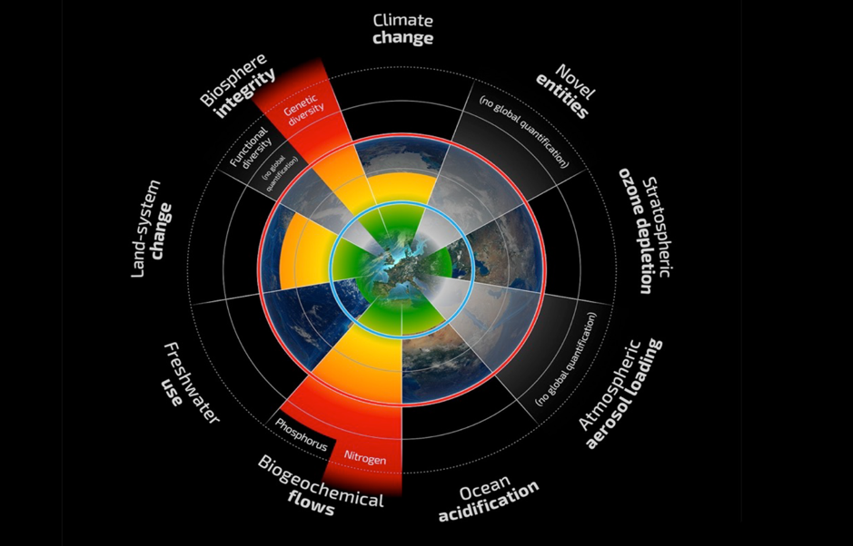
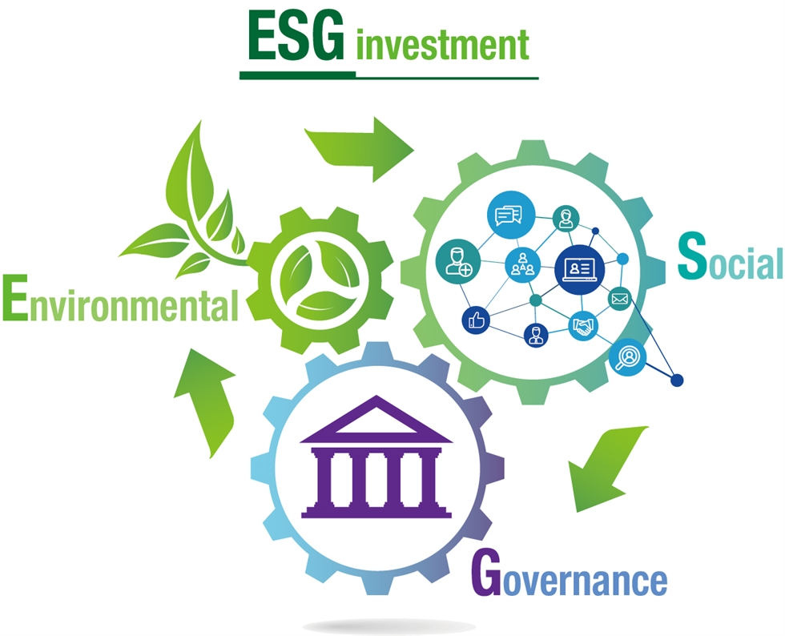

# Sustainable Development

" Sustainable development has been defined as development that meets the needs of the present without compromising the ability of future generations to meet their own needs."
https://www.un.org/sustainabledevelopment/development-agenda-retired/

This has been in the centre of my career interests since my undergrad and I have been studying agriculture as a major in this context. Being in the third year in my PhD study and thinking of future steps, I think it is a good timing to overview this global issue again and relate my interests with it to consider next actions of mine.

To this end, I would like to do a small research on frameworks to tackle sustainability issues and summarise relevant topics in a series of posts.

This is an introductory posts overviewing frameworks I'm going to investigate, such as SDGs, Planetary boundaries and ESG investing.

 

## SDGs

Needless to say, **Sustainable Development Goals** (SDGs) are the most well-known and universal agenda for sustainable development, promising **"Leave No One Behind"**.

There are **17 goals and 169 targets** to be achieved **by 2030**.
These goals and targets as well as its bfief background are explained in UN's official website (https://sdgs.un.org/goals).

Details can also be found in the following websites.
https://www.africa.undp.org/content/rba/en/home/sustainable-development-goals/background.html
https://www.un.org/sustainabledevelopment/blog/2015/09/summit-charts-new-era-of-sustainable-development-world-leaders-to-gavel-universal-agenda-to-transform-our-world-for-people-and-planet/

UN also explains these goals from more business-oriented perspectives too.
https://www.unglobalcompact.org/sdgs/17-global-goals

Some countries have established their own actions to contribute to SDGs and been publishing their progresses (examples below).

Japan: https://www.mofa.go.jp/mofaj/gaiko/oda/sdgs/index.html

Australia: https://sdgs.org.au/

To overview the progress in SDGs, **Sustainable Development Report** has been reporting each country's achievements in each goal and target in depth and conprehensively.
https://sdgindex.org/

Also, Monash University and McMaster University offer a collection of studies relevant to SDGs (and more!) from all over the world.

["Social System Evidence"](https://www.socialsystemsevidence.org/)

I will go through these goals one by one in future posts!

ちなみに日本語でも既に SDGs に関してまとめた資料が豊富にオンライン公開されていますので是非ご参照ください (Some useful links in Japanese)。

- https://www.mofa.go.jp/mofaj/gaiko/oda/sdgs/about/index.html
- https://www.meti.go.jp/policy/trade_policy/sdgs/index.html
- https://www.env.go.jp/policy/sdgs/index.html
- https://www.sdg-s.jp/
- https://www.jica.go.jp/aboutoda/sdgs/position_paper.html
- https://www.iges.or.jp/en/pub/sdgs-business-practice/ja
- https://imacocollabo.or.jp/about-sdgs/

 

## Planetary Boundaries

**Planetary Boundaries** have also been referred to as key indicators and thretholds for sustainable development, which were consisted of **nine planetary boundaries** and suggested in 2009 by a group of international scientists at **Stockholm Resilience Centre** led by a former centre director Johan Rockström.

"The planetary boundaries concept presents a set of nine planetary boundaries within which humanity can continue to develop and thrive for generations to come"
https://www.stockholmresilience.org/research/planetary-boundaries.html

"The science shows that these nine processes and systems regulate the stability and resilience of the Earth System – the interactions of land, ocean, atmosphere and life that together provide conditions upon which our societies depend."
https://www.stockholmresilience.org/research/research-news/2015-01-15-planetary-boundaries---an-update.html

These boundaries are strongly science-based and often talked together with SDGs towards a direction of "How to achieve SDGs within the planetary boundaries?"

Since, my research topics are closely associated with these boundaries, I would like to catch up with the latest discussion on them by reviewing scientific papers.

 

## ESG investing

**Environmental, social and governance investing** (ESG investing) is a form of socially responsible investing that prioritizes financial returns alongside a company’s impact on the environment, its stakeholders, and the planet.

ESG investing was suggested in **Principles for Responsible Investment** (https://www.unpri.org/) in 2006, moving the finantial sector globally towards more long-term evaluation of growth.
https://www.forbes.com/sites/georgkell/2018/07/11/the-remarkable-rise-of-esg/?sh=bc7ba4a16951

ESG investing has been rapidly growing by 143% over 2016-20 and mainly led by Europe and the US, reaching equivalent to US$25.2 trillion (or US$35.3 trillion as "sustainable investment", accounting for 36% of total assets!).
http://www.gsi-alliance.org/

There are quite a few third-party ESG-rating companies, for example...

Sustainalytics: https://www.sustainalytics.com/esg-ratings/

MSCI: https://www.msci.com/our-solutions/esg-investing/esg-ratings/esg-ratings-corporate-search-tool

The ESG criteria are closely related to SDGs and as a result propelling actions towards SDGs.

Even though this is a highly business-oriented topic, I want to understand the concept and the actual situation of this movement as a strong driving factor to achieve sustainable development.

 

## Perspectives of my little investigation...

For each topic in those frameworks, I will do research and summarise from following perspectives.

- What's been suggested?
- Why that's important?
- How far are we?
- Future prospectives?
- How do my interests and career options relate with it?

The first two points would be almost re-capping what officials have reported... probably nothing really new or unique (as written above, it's been nearly or over 10 years since suggested!) but I want to go them through to have a good understanding of the base of current discussion on sustainablity issues for myself.

I would like to introduce some of the latest key publications for each of them in third and fourth points, reaching a little beyond what's in big reports depending on the topic.

Then, I will discuss the topic in relavance to my own interests and career options so that I can outline my future steps on top of these topics. As a sub-theme of this, I would like to think of a question, "How can these global-scale issues be linked to more personal experiences, emotions and actions?"

I hope to have a sound understanding to discuss and/or possibily to advocate these issues through this investigation... approaching to a sustainable expert?
