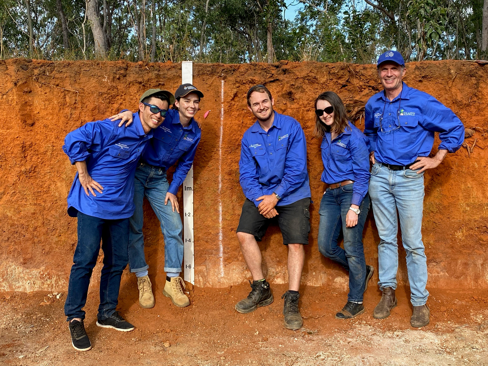

## Movements towards "Carbon Neutral"

- https://www.cas.go.jp/jp/seisaku/datsutanso/dai2/gijisidai.html

**Green growth** strategies

- https://www.meti.go.jp/press/2021/06/20210618005/20210618005.html

 

## Competition

In the competition, we had two pits for group work and one for individual.

We prepared tools and assigned roles to each of us to make most of the time given. Thanks to the practice and preparation, we could examine the soils smoothly and made decisions confidently (at least for the group ones, I messed up the individual one haha).

After working on soil judging intensively for three full days, we learned lots of knowledge on soils and improved our skills to examine them... we are soil nerds now!

 

In the end, JCU/QUT team won the 3rd place!
And one of us even won the social media prize for her excellent video summarising this competition!

 

On top of these awards, our team had interviews during the competition nad they were on the radio!!

https://www.abc.net.au/radio/programs/qld-country-hour/budding-scientists-test-soil-judging-skills/13423400

I feel so honoured to be on the media while a bit embarassed with my answers to the questions they asked haha...
The teammates even answered to those questions as well, such great science communicators!

 

So, I really enjoyed the fun and intense weekend of Soil Judging Competition 2021 thanks to the brilliant teammates, organisers and all the participants!

I'm so glad to learn this much of knowledge on soils and absolutely sure that it'll help me a lot for my research.
