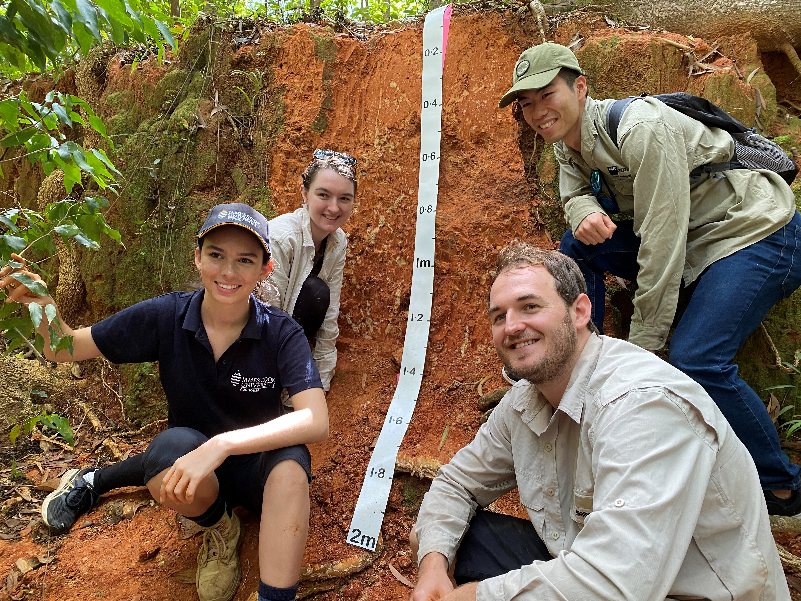
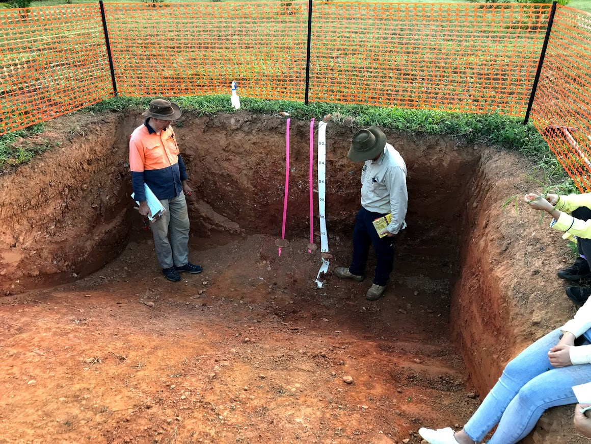
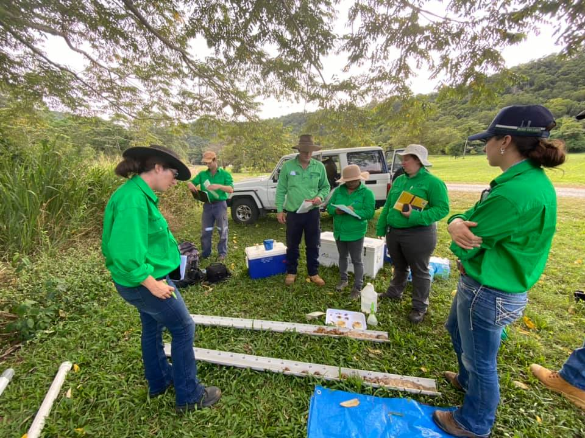

I participated in Soil Judgeing Competition 2021 from 25th to 27th June in Cairns, which was hosted by Soil Science Australia.

The event had three days in total, the first two days for practice and the last day for group/individual competition.

Since I signed up individually (just me from QUT haha), I popped in James Cook University (JCU) team, which had a great coach Paul and three fantastic undergrad earth science students!

In each practice day, we classified soils of two soil pits and one soil core.

Many of the participants (including me) had some backgrounds of soil science and took lectures in the past. We roughly know basic concepts and procedures of soil classification but have not much experienced doing it in the actual field.

"A pit is luxuary."

As the organiser said, digging this huge pit requires luxurious budget and effort. We often don't have them and need to examine the soil from the soil cores (which is still luxuary I would say!).

Before going into examination of the soil profile, we start with description of landscape. How is the land formation, slope, material, surface conditions, etc...such information helps us overview the site and understand the soil at the macto scale.

Then, we move onto the soil profile. We check the horizons, texture, colour, structure, fragments, etc by visual, physical and chemical analytical techniques.

I'll summarise details of soil classification processes in further posts!

 

## Competition

In the competition, we had two pits for group work and one for individual.

We prepared tools and assigned roles to each of us to make most of the time given. Thanks to the practice and preparation, we could examine the soils smoothly and made decisions confidently (at least for the group ones, I messed up the individual one haha).

After working on soil judging intensively for three full days, we learned lots of knowledge on soils and improved our skills to examine them... we are soil nerds now!

 

In the end, JCU/QUT team won the 3rd place!
And one of us even won the social media prize for her excellent video summarising this competition!

 

On top of these awards, our team had interviews during the competition nad they were on the radio!!

https://www.abc.net.au/radio/programs/qld-country-hour/budding-scientists-test-soil-judging-skills/13423400

I feel so honoured to be on the media while a bit embarassed with my answers to the questions they asked haha...
The teammates even answered to those questions as well, such great science communicators!

 

So, I really enjoyed the fun and intense weekend of Soil Judging Competition 2021 thanks to the brilliant teammates, organisers and all the participants!

I'm so glad to learn this much of knowledge on soils and absolutely sure that it'll help me a lot for my research.
