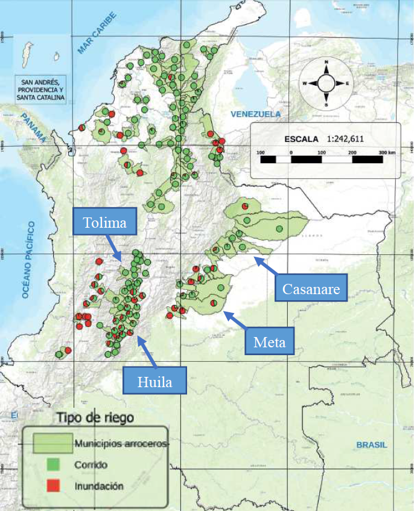
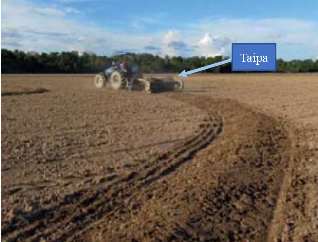
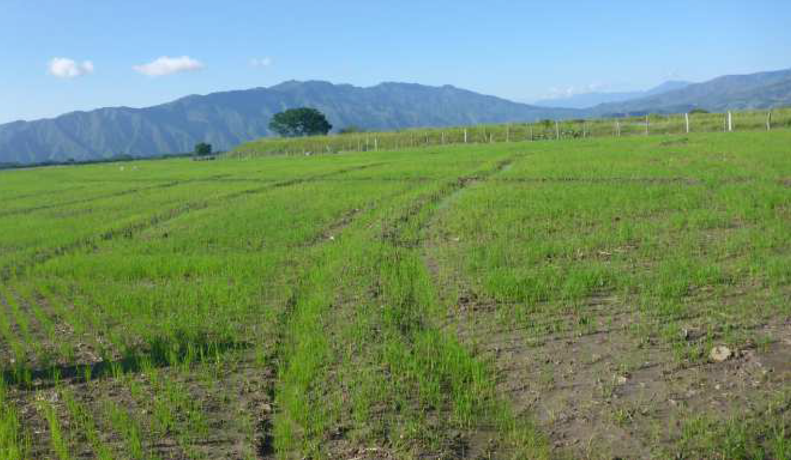
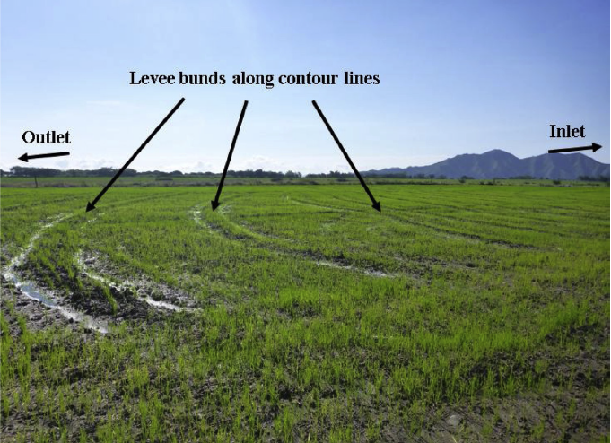
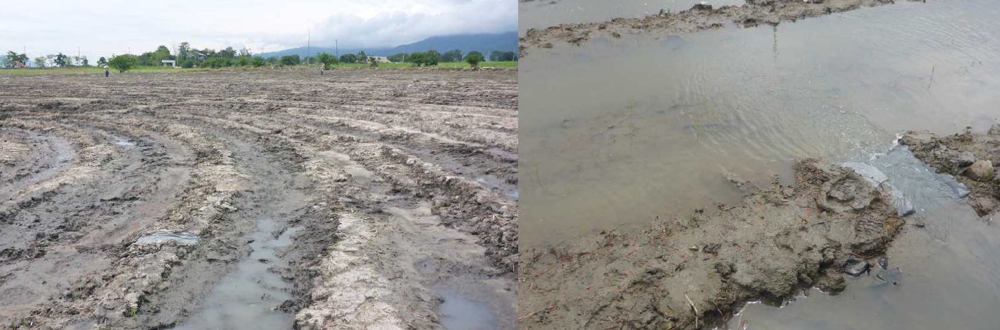

# Contour-levee irrigation system

Contour-levee irrigation system is a land-management and irrigation practice for lowland rice cultivation in sloped fields and practiced commonly in a part of US, Latin America and the Caribbean. For example in Colombia, the contour-levee irrigation system accounts for 70.1% of the irrigated rice area (FEDEARROZ, 2017), including the major rice producing departments, Tolima, Huila, Meta, and Casanare (Fig. 1). Similar practices of the contour-levee irrigation system are adopted in other major irrigated rice producing areas in the LAC region such as those in Argentina (Marano and Filippi, 2015), Brazil (Takamiya and Tsutsui, 2000), and Uruguay (Battallo et al., 2013).

Figure 1. Distribution of irrigation systems in Colombia shown as ratio between contour-levee irrigation system (green, “Corrido”), and flat-flooded system (red, “Inundación”) in each municipality represented by each circle (modified figure from FEDEARROZ (2017))

 

## Colombia

---

Rice farmers construct levees (bunds, and called “caballon” in the local language, Spanish) along the contour lines to hold water within the plot, which is easily lost via runoff otherwise (Pineda and Montaña, 2015). The height of the contour levees is approximately 12 cm along the contour lines using a machinary called “Taipa”, which enables construction of such low levee bunds without deep depression aside (Fig. 2.). Rice seeds can be sown over the entire plot including the top part of the contour levees by direct dry-seeding machines to maintain the spatial uniformity of rice growth is (Fig. 3.). Local farmers commonly plough and level the land before construction of the levees but do not puddle the field.

Figure 2. Construction of contour levees with “Taipa” (picture from FEDEARROZ (2015))

Figure 3. Sowing over the entire plot including the top part of levee bunds.

Irrigation is started after sowing and is intermittently applied from an inlet at the highest side of the plot, and the water flows down and drains out through an outlet at the lowest side as runoff (Fig. 4). Observing the first irrigation, some spots of the contour levees which have overflow of irrigation water are destructed to be slits to prevent other parts of the levees from being damaged and to enable irrigation water to flow down smoothly (Fig. 5).

Figure 4. Contour-levee irrigation system with arrows showing the constructed levees and flush irrigation is applied from the inlet at the upper side.

Figure 5. Slits in contour levees allowing water flow down the plot.

 

## Argentina

---

The National Agricultural Technology Institute (INTA) has recommendation of a similar irrigation practice for rice farmers in Argentine (Kraemer et al., 2011). Low height of levees is regarded as very important and ideally ranging from 13 to 17 cm in order to allow machines to enter the plot, to avoid water logging problems in the deep spots, and to mitigate the heterogeneity of the field. Ponded water table is recommended to be maintained at 5-10cm in vegetative phase after 14 to 17 days after emergence, at 15-25 cm in reproductive phase, and gradually decreased from the period 15 to 20 days after flowering. Regarding the speed of irrigation, it is recommended to reach the entire plot within 5 days.

 

## Uruguay

---

In Uruguay, Asociación de Cultivadores de Arroz (ACA) has developed rice cultivation recommendation, and implementation of a very similar irrigation system is described (Battallo et al., 2013). The height of levees should be lower than 15 cm so that the ponded water table stays low and irrigation water requirement would not become high, and also that the top of the levees remains wet. Alike the instruction of Argentine, irrigation should be continued from 15-30 days after emergence until the maturity. In addition, irrigation water consumption is reported to range typically from 1100 to 1400 mm ha-1 to irrigate for about 100 days.

 

## US

---

Arkansas, Louisiana, and Mississippi in the US also have rice production under the contour-levee irrigation system together with straight-levee and zero-grade systems. Contour levees with height of 30-45 cm are constructed at approximately every 60 mm in elevation drop by pushing up after dry seeding the crop and adjustable spills are placed in the levees (Henry et al., 2016). Managing the irrigation system requires expert knowledge on how much water to pump so that all paddies are filled with little runoff from the lowest paddy (Vories, et al., 2005). In addition, the curvature of levee bunds makes maintainance of them and the harvest more labour-intensive and difficult (Laughlin & Mehrle, 1996).

Straight-levee and zero-grade practices also became common for rice production as the precision levelling practiced (Laughlin & Mehrle, 1996). Under straight-levee irrigation system, fields are graded by earth moving equipment and have nearly zero side-slope, typically about 0.1% depending on soil properties prior to leveling, resulting in relatively uniform space between levees with 30–60 mm of difference in relative elevation (Smith et al., 2007). As a result of the straight levee lines, effectiveness of harvest and of other ground equipment for input application was improved, and cost reduction was achieved (Laughlin & Mehrle, 1996). In case of zero-grade system, fields are graded in all directions to have no or little slope to minimize the flood depth variation (Henry et al., 2016). A small canal is built on three or four sides of the field and water is pumped into the canals to flood the field quickly from multiple sides, enabling quick flooding and constant ponded water depth across the field. On the other hand, the drainage in zero-grade systems is not good as in sloped fields, affecting the productivity of the crops rotated with rice, especially soybean. Many producers thus conduct continuous rice production under zero-grade system.

Among the three irrigation systems, contour-levee fields have minimal land improvements, and the levees follow the natural contour of the land. In Arkansas, almost half of the total rice acres has the contour-levee irrigation system, about 45 % has straight-levee system, and only about 5 % has zerograde system (Henry et al., 2016). Traditionally, the entire field under any of the three irrigation system is flooded with constant depth of approximately 80–150 mm throughout much of the growing season
in the regions (Smith et al., 2007). The irrigation water use was reported as 789-1100, 653-950, and 382-500 mm in contour-levee, straight-levee, and zero-grade systems in Arkansas and Mississippi (Henry et al., 2016) (Massey et al., 2014) (Smith et al., 2007). Irrigation water input was generally lower in clay soil compared to silt loam soil, although the difference was not significant (Henry et al., 2012; 2016).

 

## So, how much water is needed?

---

In spite of the constructed levees, considerable amount of irrigated water seems to drain out from the plot along the slope. Comparison of water use in the three irrigation systems in the US indicate the contour-levee irrigation system in sloped rice fields would require almost double of the irrigation water needed for flat fields. Even though this irrigation system is widely practiced in Colombia, the irrigation water use and water use efficiency of rice production under contour-levee irrigation system is yet to be fully understood.

...Thus, we investigated the irrigation water use and efficiency of contour-levee irrigation system on commercial rice farms in Colombia! Hope this article helps you know more about the unique irrigated rice system.

Takeda, N., López-Galvis, L., Pineda, D., Castilla, A., Takahashi, T., Fukuda, S., & Okada, K. (2019). Evaluation of water dynamics of contour-levee irrigation system in sloped rice fields in Colombia. Agricultural Water Management, 217, 107-118.
https://doi.org/10.1016/j.agwat.2019.02.032

 

## References

---

- Battallo, C., Queheille, N., Uraga, R., Gonnet, D., Hill, M., Roel, A., … Pippolo, D. (2013). Guía De Buenas Prácticas En El Cultivo De Arroz En Uruguay. Retrieved from http://www.aca.com.uy/manual-de-buenas-practicas-agricolas

- FEDEARROZ. (2015). Adopción Masiva de Tecnología: Guía de trabajo. Bogotá, Colombia.

- FEDEARROZ. (2017). Ⅳ CENSO NACIONAL ARROCERO 2016. Bogotá, Colombia.

- Henry, C. G., Vories, E., Reba, M., & Hirsh, S. (2012). Characterizing irrigation water requirements for rice production from the Arkansas rice research verification program. In 2012 Dallas, Texas, July 29-August 1, 2012 (p. 1). American Society of Agricultural and Biological Engineers.

- Henry, C. G., Hirsh, S. L., Anders, M. M., Vories, E. D., Reba, M. L., Watkins, K. B., & Hardke, J. T. (2016). Annual irrigation water use for Arkansas rice production. Journal of Irrigation and Drainage Engineering, 142(11), 05016006.

- Kraemer, A., Moulin, J. F., Marín, A., Kruger, R. D., & Herber, L. (2011). Manual del Aguador Arrocero: Principios básicos para el Manejo del riego en el cultivo de arroz. Instituto Nacional de Tecnología Agropecuaria.

- Laughlin, D. H., & Mehrle, R. K. (1996). Economic evaluation: straight versus contour levee rice production practices in Mississippi. Bulletin.

- Marano, R. P., & Filippi, R. A. (2015). Water Footprint in paddy rice systems. Its determination in the provinces of Santa Fe and Entre Ríos, Argentina. Ecological indicators, 56, 229-236.

- Massey, J. H., Walker, T. W., Anders, M. M., Smith, M. C., & Avila, L. A. (2014). Farmer adaptation of intermittent flooding using multiple-inlet rice irrigation in Mississippi. Agricultural Water Management, 146, 297-304.

- Pineda, D., Montaña, H., 2015. Principios Básicos Para El Manejo Eficiente Del Agua En El Cultivo De Arroz En Colombia. FEDEARROZ, Bogotá, Colombia.

- Smith, M. C., Massey, J. H., Branson, J., Epting, J. W., Pennington, D., Tacker, P. L., ... & Wilson, C. (2007). Water use estimates for various rice production systems in Mississippi and Arkansas. Irrigation science, 25(2), 141-147.

- Takamiya, K., Tsutsui, H., 2000. Rice and irrigation in Latin America. Rural Environ. Eng. 38, 5–19.

- Vories, E. D., Tacker, P. L., & Hogan, R. (2005). Multiple inlet approach to reduce water requirements for rice production. Applied Engineering in Agriculture, 21(4), 611-616.
