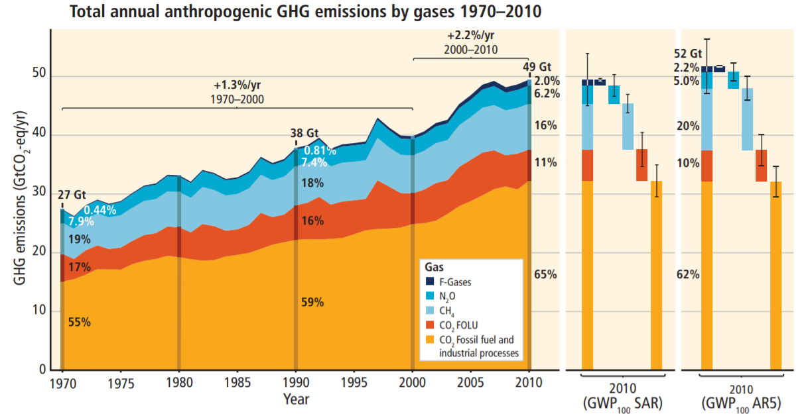
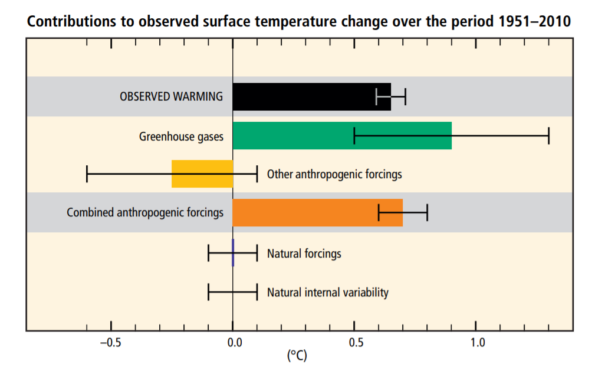
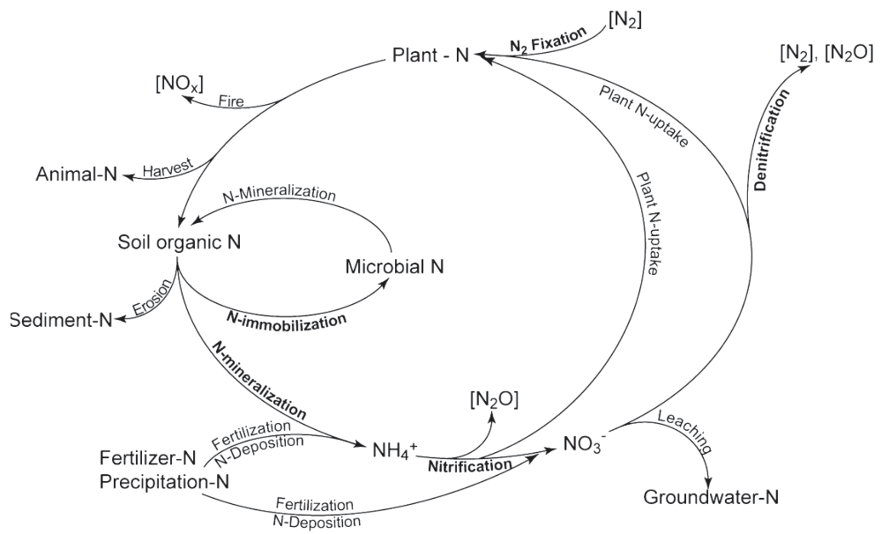

## Greenhouse Gas and Climate Change

---

Greenhouse gas (GHG) is a term for gases which trap heat in the atmosphere. Major GHGs are carbon dioxide (CO2), methane (CH4) and nitrous oxide (N2O). Anthropogenic GHG emissions since the pre-industrial era have been increasing (Fig. 1) and driven large increases in the atmospheric concentrations of CO2, CH4 and N2O.

Figure 1. Total annual anthropogenic GHG emissions by gases 1970–2010 (source: IPCC (2014))

 

As widely known, emissions of GHG contribute to the increase in the global temperature. More than half of the observed increase in global average surface temperature from 1951 to 2010 was attributed to the anthropogenic increase in GHG concentrations and other anthropogenic forcings together (Fig. 2).

Figure 2. Contributions to observed surface temperature change over the period 1951–2010 (source: IPCC (2014))

 

Further details of GHG and its potential impacts are on IPCC's synthesis report.

(The latest report is AR5 in 2014 and AR6 is scheduled in 2022)

https://www.ipcc.ch/report/ar5/syr/

 

## Nitrous oxide

---

Nitrous oxide (N2O) is a long-lived atmospheric trace gas with a global warming potential 265–298 times higher than that of carbon dioxide (CO2) over a 100-year period (Myhre et al., 2013). Also, N2O has been considered the primary ozone-depleting substance in the 21st century (Ravishankara et al., 2009; Portmann et al., 2012). Croplands are globally responsible for 66% of total anthropogenic N2O emissions and these emissions are predicted to double by 2050 (Davidson & Kanter, 2014). In soils, N2O is mainly produced by the microbial processes of autotrophic nitrification (oxidation of ammonium to nitrate) and heterotrophic denitrification (reduction of nitrate to N2O and ultimately N2) (Butterbach-bahl et al., 2013) (Fig. 3).

Figure 3 N transformations (source: Robertson and Groffman (2007)).

 

A range of soil parameters influences these processes, such as oxygen (O2) availability (often indicated by soil moisture), temperature, organic carbon (C) availability and substrate (NH4+ and NO3-) availability (Butterbach-bahl et al., 2013). The magnitude of N2O emissions from a cropping system is promoted particularly by N fertiliser inputs, which are estimated to account for 54% of the total increase of the global N2O emissions in the recent decade (Tian et al., 2019). Efficient use of N fertiliser in agricultural systems is thus essential to balancing productivity and environmental impacts.

 

## References

---

- Butterbach-bahl, K., Baggs, E. M., Dannenmann, M., Kiese, R., & Zechmeister-boltenstern, S. (2013). Nitrous oxide emissions from soils : how well do we understand the processes and their controls ? Phil Trans R Soc B, 368, 1-20. doi:20130122

- Davidson, E. A., & Kanter, D. (2014). Inventories and scenarios of nitrous oxide emissions. Environmental Research Letters, 9(10), 105012. doi:10.1088/1748-9326/9/10/105012

- IPCC, 2014: Climate Change 2014: Synthesis Report. Contribution of Working Groups I, II and III to the Fifth Assessment Report of the Intergovernmental Panel on Climate Change [Core Writing Team, R.K. Pachauri and L.A. Meyer (eds.)]. IPCC, Geneva, Switzerland, 151 pp.

- Myhre, G., Shindell, D., Bréon, F., Collins, W., Fuglestvedt, J., Huang, J., . . . Mendoza, B. (2013). Anthropogenic and Natural Radiative Forcing, Climate Change 2013: The Physical Science Basis. Contribution of Working Group I to the Fifth Assessment Report of the Intergovernmental Panel on Climate Change, 659–740. In: Cambridge: Cambridge University Press.

- Portmann, R. W., Daniel, J. S., & Ravishankara, A. R. (2012). Stratospheric ozone depletion due to nitrous oxide: Influences of other gases. Philosophical Transactions of the Royal Society B: Biological Sciences, 367, 1256-1264. doi:10.1098/rstb.2011.0377

- Ravishankara, A. R., Daniel, J. S., & Portmann, R. W. (2009). Nitrous Oxide (N2O): The Dominant Ozone-Depleting Substance Emitted in the 21st Century. Science, 326(5949), 123. doi:10.1126/science.1176985

- Robertson, G. P., & Groffman, P. M. (2007). Nitrogen transformations. In Soil microbiology, ecology and biochemistry (pp. 341-364). Academic Press.

- Tian, H., Yang, J., Xu, R., Lu, C., Canadell, J. G., Davidson, E. A., . . . Zhang, B. (2019). Global soil nitrous oxide emissions since the preindustrial era estimated by an ensemble of terrestrial biosphere models: Magnitude, attribution, and uncertainty. 25(2), 640-659. doi:10.1111/gcb.14514
