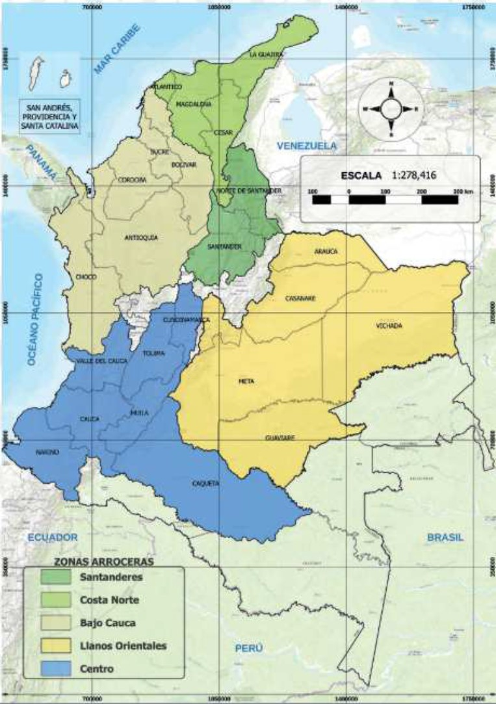
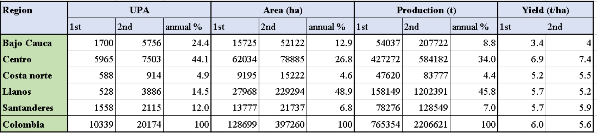
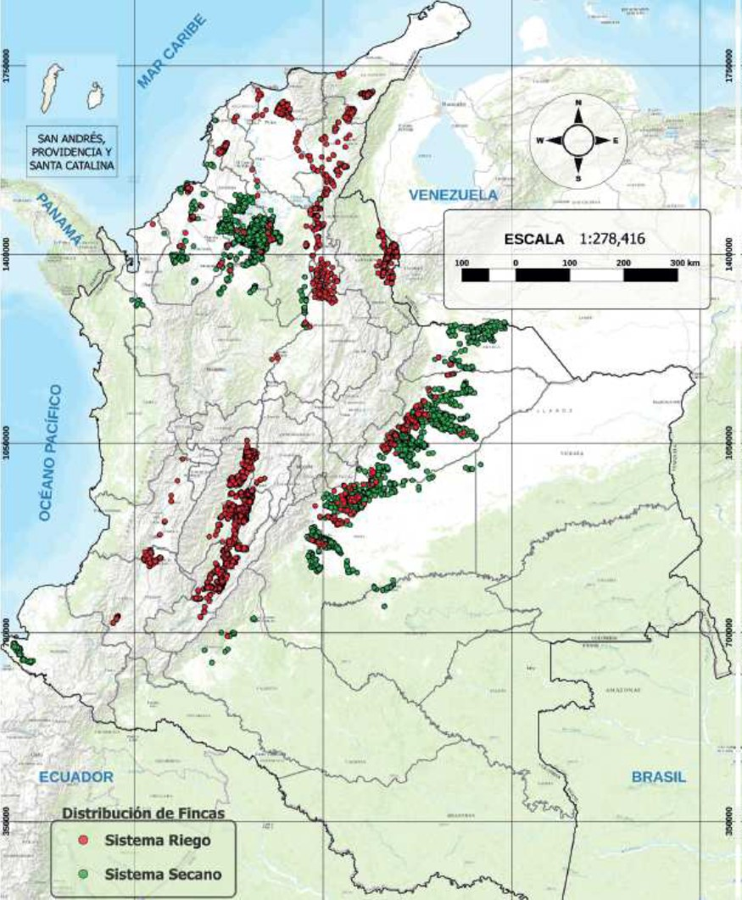

# Rice in Colombia

---

Colombia is located in Tropical region and its climate is humid to sub-humid. The annual rainfall is about 2000 mm with bimodal annual rainfall pattern. There are two major sowing seasons, Mar-Apr (Semester 1) and in Aug-Oct (Semester 2) with harvesting seasons in Jul-Aug and in Jan-Mar (McLean et al., 2013). Rice is cultivated in five zones: Centro, Llanos Orientales, Bajo Cauca, Costa Norte, and Santanderes (Fig. 1). The Centro and the Llanos Orientales regions account for about half of Colombian rice producers, about 75% of rice cultivated area and almost 80% of production (Table 1). Tolima, Meta, and Casanare departments located in the two regions account for about 70% of nthe ational rice production (FEDEARROZ, 2017).

Figure 1. Five rice production regions in Colombia. (FEDEARROZ, 2017)

 

Table 1. Statistics of mechanised rice production in the five rice production regions in Colombia (Data from FEDEARROZ (2017))

1st and 2nd indicate the semester 1 and the semester 2 respectively, and were summed to calculate annual %

UPA: “Unidad Productora de Arroz” in Spanish, indicates a registered group or farm producing rice.

 

Rice is cultivated under both irrigated and rainfed (mostly lowland) conditions and over 70% of rice area has already been irrigated (FEDEARROZ, 2017). Even though the annual rainfall is relatively large, rainfed rice cultivation is common only in the Bajo Cauca and the Llanos Orientales regions (Fig. 2). Over 90% of Colombian rice systems are mechanised in terms of both rice cultivated area and rice production (FEDEARROZ, 2017).

Figure 2. Irrigated (red dots) and rainfed (green dots) rice systems in Colombia (FEDEARROZ, 2017).

High production costs are raising concerns about rice production in Colombia, resulted mainly from the high cost of inputs such as water and fuel (McLean et al., 2013). No development of new irrigation districts for the recent 30 years causes unavailability of new farmlands equipped with irrigation. Deficiency and uncertainty of irrigation water supply compared to the large rice cultivated area limit the rice production (Personal communication with FEDEARROZ and local rice farmers). The land cost is also increasing due to (1) deterioration of watersheds, (2) a rise in the number of tenants (58% of Colombian rice producers are tenants) and (3) the lower number of short-cycle crops to rotate with rice due to competitions with cheap imported products. Therefore, enhancement in yield and water use efficiency by improving field crop managements is essential for Colombian rice farmers.

 

## References

---

- McLean, J., Hardy, B., & Hettel, G. (2013). Rice Almanac, 4th edition. IRRI, Los Baños, Philippines. http://doi.org/10.1093/aob/mcg189

- FEDEARROZ. (2017). Ⅳ CENSO NACIONAL ARROCERO 2016. Bogotá, Colombia.
