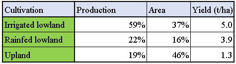

# Rice in Latin America and the Caribbean

---

Rice is an essential crop both as a staple food and income source for the large part of people in the Latin America and the Caribbean (LAC) region (McLean et al. 2013). The per capita annual consumption of rice in LAC increased from about 9 kg of milled rice in 1924-28 to about 30 kg in 2008-10, especially in the Tropical regions reaching 37 kg on average. Rice is income elastic in the region (consumers tend to increase consumption as their incomes rise) and preferred by the poor because it is cheap, nutritious, appealing, easy to prepare, and easy to store and transport. In addition, about one million farmers in the region reply on rice not only as their main source of energy, but also for employment and income.

Among the rice producing countries, those in the LAC region have relatively recently started rice cultivation. 26 countries in the LAC region grow rice and almost 90% of the total rice production in Latin America is carried out by 9 countries: Brazil, Colombia, Peru, Mexico, Argentina, Cuba, Ecuador, Venezuela, and Uruguay (Takamiya & Tsutsui, 2000). Total production of paddy rice in the region increased from around 8 million tons in 1961 to more than 28 million tons in 2009, resulting in an increase of over 250% (Zorrilla et al., 2012). Rice yield in the region has risen by adopting irrigation and the continuous release of improved varieties (McLean et al., 2013), and is expected to rise with an annual yield increase of around 2% by 2050 (Ray et al., 2013). However, the rate of yield increase has been lower compared to other important cereals, such as wheat and maize (Takamiya & Tsutsui, 2000) and the LAC region as a whole has still relied on import to satisfy the increasing domestic demand on rice (Pulver, 2003). Further improvement in the rice yield is required to meet the demand of rice in the LAC region.

More than two-thirds of Latin America’s arable lands are in lowland ecosystems and rice is well adapted to the wet soils common in lowlands (McLean et al., 2013). The distribution of major ecosystems for rice production in LAC and the three different rice production systems (Irrigated lowland, rainfed lowland, and upland) are summarized below (Table 1 and Table 2). Among the LAC countries, Brazil is the biggest rice producer and heavily biased to upland rice cultivation, resulting in low yield below 3.0 t/ha on average (Takamiya & Tsutsui, 2000). Cultivated land area for rice in Brazil accounts for 65% of all the rice area and for 62% of upland rice area in the LAC region. Regarding to production, Brazil produces 52% of all irrigated rice, 38% of all rainfed rice, and 92% of all upland rice in the region. Rice in Brazil is mostly grown under upland conditions with acid soils and results in low yield, while the majority of rice in other countries is grown under irrigated conditions with more fertile soils.

Table 1 Distribution of rice production regions among eco-systems in the LAC region. Data from McLean et al., (2013)

Table 2 Rice production, rice cultivated area, and grain yield among the cultivation systems in the LAC region

The characteristics of the rice cultivation in the LAC region are large farm lands (15–50 ha on average), high rate of mechanization (94%) and irrigation (59%) and dry direct seeding, while only 6% of the total rice area adopts the Asian transplanting system (McLean et al., 2013; Singh et al., 2017). Also, practices with high dose of purchased inputs, such as commercial varieties, water, fertilizer, and agrochemicals are typically conducted in the region (McLean et al., 2013). These features are resulted from the situation of the region where abundant lands are available but labor is scarce and costly. However, improvement in their crop management to reduce those inputs is currently desired, since the rice production is demanded to be more efficient with less cost as mentioned above. Takamiya & Tsutsui (2000) mentioned that high productivity was achieved by the extensive irrigation networks covering almost the entire paddy field area and irrigation was associated with heavy use of fertilizer along with high-yielding rice varieties. Proper water management, therefore, can play an important part to stable and highly productive rice cultivation in the LAC region.

## References

---

- McLean, J., Hardy, B., & Hettel, G. (2013). Rice Almanac, 4th edition. IRRI, Los Baños, Philippines. http://doi.org/10.1093/aob/mcg189

- Pulver, E. L. (2003). Strategy for sustainable rice production in Latin America and the Caribbean. In D. Van Tran & R. Duffy (Eds.), Sustainable Rice Production for Food Security, Proceedings ofthe 20th Session International, Rice Commun, Bangkok, Thailand, 23–26 July 2002 (pp. 287–299). Rome, Italy: FAO. Retrieved from http://www.fao.org/docrep/006/y4751e/y4751e0t.htm

- Ray, D.K., Mueller, N.D., West, P.C., Foley, J.A. (2013). Yield trends are insufficient to double global crop production by 2050. PLoS One 8 (6), e66428. https://doi.org/10.1371/journal.pone.0066428

- Takamiya, K., & Tsutsui, H. (2000). Rice and Irrigation in Latin America. Rural and Environmental Engineering, 38, 5–19.

- Zorrilla, G., Martínez, C., Berrío, L., Corredor, E., Carmona, L., & Pulver, E. (2012). Improving Rice Production Systems in Latin America and the Caribbean. In Eco-efficiency: From Vision to Reality (pp. 161–170)
