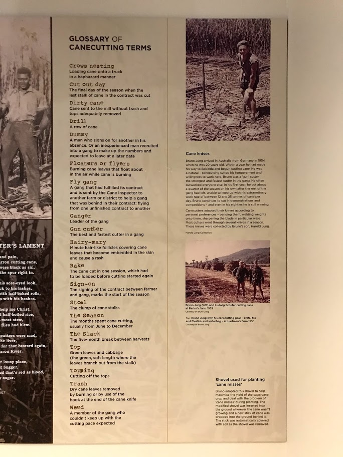

It was so nice to be in Cairns, Far North Queensland in July. I appreciated the warm but not too humid weather so much (and absence of lockdown during this particular time). Fortunately I took several days off after the conference, allowing me to see most of the highlights around Cairns. I summarise these trips very briefly in this post.

## Cairns city

The city of cairns is pretty small... you can walk around the central area for a half day. You have so many options of cafes for morning coffee or afternoon break and also Japanese restaurants for dinner!

There were a couple of places to see such as the art museum, acuarium and esplanade. Among them, I would recommend **Cairns Museum** (https://www.cairnsmuseum.org.au/), which is a small museum located in the heart of the city but contains a variety of historic collections from aboriginal to the modern industrial exhibitions.

Cairns has prospered for gold mining, sugar industry and tourism. As a researcher working on sugarcane, I was obviously interested in the history of the sugar industry here, which was actually boosted by Asian immigrants including Chinese and Japanese. I loved the "Glossary of Canecutting Terms"... my favourite is "Weed" haha

The staffs in the museum were so nice and explained me not only about the exhibited items but also some historic places and monuments in the city... such as the monument of Chinese immigrants and the Greek food shop made of stones which were reused from the lost sugar mill.

Also, I shouldn't forget about **Rusty's Markets**, which is open from Friday to Sunday and has heaps of fresh tropical fruits and vegetables as well as variety of take-away foods.

 

## Great Barrier Reef (GBR)

**Green Island** was so popular and a lot of tours include snorkeling around the island. However, I would not recommend this island if your primary interest is to see the coral reef and tropical fish, just like me...

The field trip of the conference took me to this island but I was so dissapointed and desparate to see the coral reef, expecting a world like "Nemo". Then I joined a group from the conference and signed up for a boat tour going to **Upolu Reef**, located in the Outer Reef.

This tour included snorkeling, glass bottom boats and optional scuba diving at two spots around the reef. The coral reef was totally different with much brighter colours and more variation in shapes! I also did scuba diving for the first time after 5 years! I almost forgot everything and had difficulties at the beginning but enjoyed the view right in front of the coral reef as well as the closer look at the tropical fish.

Well, I would of course like to add a lot more pictures and videos but the SD card we used to take them under the sea is currently in hands of the group of people from the conference... hopefully they will send the photos to me shortly!

Although I was quite satisfied with the outer reef tour, there are so many places to see the coral reef and thus tours! Some tours are departing from Port Douglas, which is one and half hours North of Cairns. Also, Jame Cook University has a research station in **Orpheus Island** (https://www.jcu.edu.au/orpheus-island) and might have study tours and/or workshops related to the GBR available for tourists. I will definitely come back to see the GBR further after getting certificates of diving!

 

## Kuranda

**Kuranda** is a small village and used to have an active gold mining. **Kuranda Scenic Railway** (https://www.ksr.com.au/Pages/Default.aspx) was originally the railway to carry basic supplies for the mining workers in Kuranda from Cairns and is now the touristic train telling the history. The train truck was all built by hand, which includes quite a few bridges and tunnels!

Near the Kuranda village, the train stops at the Barron Fall and you can get off and take photos for a while. It was in the middle of the dry season and thus did not have much water... nevetherless, it's a magnificent view looking down on the gorge and waterfall.

In the village, you can hear aboriginal people playing and find so many shops for art crafts and foods.

Apart from the unique atmosphere and the lively market, I liked **Kuranda Butterfly Sanctuary** (https://australianbutterflies.com/), which offers a very unique exhibition of butterflies (and moths) including Cairns Birdwing, Ulysses and Hercules Moth with rich explanations of their ecology.

If you took the Scenic Railway to come to Kuranda, going back via **Skyrail** (https://www.skyrail.com.au/) is highly recommended (vice versa). You can overview the beautiful rainforest around Kuranda and see the Smithfield area meeting the reef.

 

## Daintree rainforest

Another natural attraction of Cairns is the oldest rainforest in the world, "Daintree rainforest", which is locate 2-2.5 hours North of Cairns. I wish I could rent a car but it was too expensive due to the school holidays and just joined a tour this time.

The tour dropped off at the Mossman Gorge Visitor Centre, where we saw a demonstration of aboriginal tribe, Kuku Yalanji people. They have occupied this rainforest area for long time and got a lot of knowledge to survive in the rainforest.

We then visited **Mossman gorge**, a beautiful gorge with a well managed easy trail. I hoped to see ulysses and cassowaries but couldn't... apparently it is rare to see those wildlives in this trail.

Speaking of cassowaries, they are considered as a key-stone species of this huge ancient rainforest because so many plant species (estimated up to 238!) rely on cassowaries for dissemination of their seeds. Cassowaries play an essential role in the survival of this rainforest.

The tour included a boat tour to see crocodiles. I also saw a beautifule blue kingfisher... from a distance and could not take a clear picture but it looked so elegant. You can see a variety of mangrove trees around the river too.

The tour's last and the main destination is **Cape tribulation**, where the rainforest meets the reef. Such a beautiful place, I wish I could stay there longer on a sunnier day!

 

## Port Douglas

At the end of the Daintree tour, I decided to stay in **Port Douglas** and asked the guide to leave me when they drop by there. Port Douglas is a resort village located between Daintree and Cairns.

**Four Mile Beach** is one of the nearest beach to Port Douglas and offers the iconic view... but the weather didn't allow us to see its full potential unfortunately :(

An interesting pattern on the beach made by sand crabs...reminding me of dotted patterns on aboriginal art crafts?

We somehow ended up with learning how to open coconuts without tools on the beach! It was actually feasible, thanks a crazy russian guy on Youtube lol

The village and hostels were full of Chilean and Argentinian people by the way... they love beaches so much. It was great to have free spanish conversation classes haha

By the way the public transport between Port Douglas and Cairns is quite limited. Transfer shuttle buses run daily but pretty expensive for one person and it does not go to Cairns but only to the airport.
Apparently a facebook group page for backpackers around Cairns is active and advertisements of lifts are often seen. In my case, the Daintree tour I joined offered me a transfer service back to Cairns. However, it would be better to rent a car to explore around Daintree/Port Douglas during normal seasons.

 

## Tableland

After going around Cairns and surrounding areas, I got interested in **Tableland** area. We actually had a field trip around this area but I did not go for it since we passed during the soil judging competition... shame on me. This region is famous for its diverse agricultural products grown on the volcanic soils.

There are a couple of food tasting tours and I picked one (https://www.cairnsfoodwinetours.com.au/) which included seven stops, Rainforestation, Winary, Skybury, Gallo Dairyland, Mount Uncle Distillery, The Humpy and Platypus HUt (Sweetwater eco lodge). I personally wanted to see more farming practices in each stop but the tour simply focused on tasting... still great though!

These stops are scattered from North of the tableland near **Mareeba** to South of the tableland near **Atherton** and you can also see a very clear change in the landscapes from rainforest near Kuranda to woodland in Mareeba.

There are other options than tours if you have a car... I would love to explore more on my own next time!

https://www.athertontablelands.com.au/travel-directory/taste-paradise-food-trail/
https://www.cairnsdiscoverytours.com/atherton-tablelands-food-wine-day-tour/
https://www.tropicalnorthqueensland.org.au/articles/13-fun-food-trail-follies-atherton-tablelands/

 

## Cairns Botanic Garden

On the last day of my stay, I also visited **Cairns Botanic Garden** (https://www.cairns.qld.gov.au/facilities-sport-leisure/botanic) near the airport.

They offer an awesome guided tour (for free!) at 10:00 every day and you can get to know a little more details and stories of what you can see in the botanic garden.

 

## For the next time...

So, I could see not only Cairns and the GBR, but the surrounding areas such Kuranda, Daintree, Port Douglas and the tableland... such highlights of Cairns!

Cairns has got a lot of wonderful attractions and those I could visit seems only a small part. I wanna come here and see them next time!

- More reefs and dives, in particular Orpheus island research station (JCU)... after getting a diving certificate!

- More foodie and farming places on my one by car

- Hidden spots such as Mila Mila waterfall and Paronella

It was such an amazing stay in Far North Queensland, see you soon!
